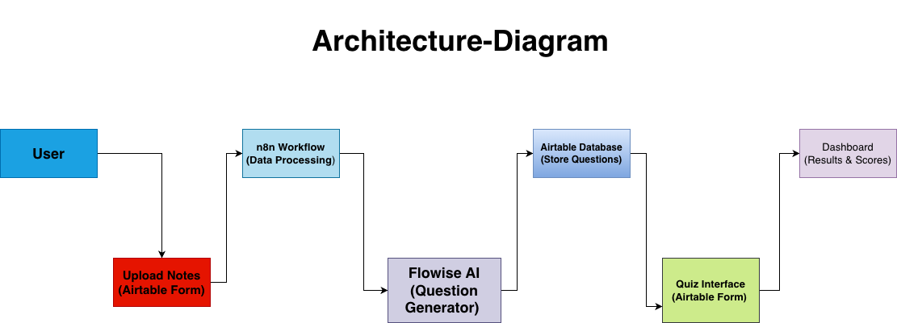

# Project Name: AI Quiz Generator

## Problem Statement:
Many students struggle to turn their notes into useful practice questions for quizzes. Creating quizzes manually can be time-consuming and difficult, which leads to poor preparation and lower academic performance. Our project aims to solve this problem by using artificial intelligence to automatically generate quizzes from student-uploaded notes. This will help students study more efficiently, test their understanding, and improve retention of course material.

## Target users:
The primary users of this system are college and high school students who want an easier way to review and test their knowledge. 

## Architecture

## Name: Maryem Elgebaly, Role: Question Generator, GitHub: @maryem2005 
## Name: Ryan Maca, Role: Data Ingestion, GitHub: @RyanMaca01
## Name: Noeleen Herbert, Role: Quiz Delivery, GitHub: @missherbs 
## Name: Maria Shirin, Role: Integration, GitHub: @MariaIsCoding

## Component Breakdown:

## Ryan’s Role: Data Ingestion
Description:
 Accept user-uploaded notes through an Airtable form and store them for processing.
Tools:
 Airtable, n8n
Input:
 User uploaded notes (PDF, text, docs)
Output:
 Structured text stored in Airtable
Standalone demo:
 Upload notes and confirm they appear in Airtable database

## Maryem’s Role: Question Generator 
Description:
 Use AI to generate quiz questions and answers from uploaded notes.
Tools:
 Flowise, Groq API, Airtable
Input:
 Student notes text
Output:
 Quiz questions and answer key
Standalone demo:
 Generate a quiz from the sample document

## Noeleen’s Role: Quiz Delivery
Description:
 Display the quiz to the student and collect responses.
Tools:
 Airtable Form, Dashboard
Input:
 Quiz questions
Output:
 Student answers and scores
Standalone demo:
 Take the quiz and view the results

## Maria’s Role: Integration
Description:
 Connect all components and ensure a smooth workflow.
Tools:
 n8n, Airtable
Input:
 All system components
Output:
 Complete working quiz system
Standalone demo:
 Full quiz generation and completion process
 
 ## How to Run
1. Upload notes using Airtable form
2. System generates quiz questions automatically
3. User completes quiz and views results 

## Timeline: 
Week 3, Milestone: Proposal and architecture 
Week 4-6, Milestone: Build components
Week 7-9, Milestone: Add Al features 
Week 10-12, Milestone: Integration 
Week 13-14, Milestone: Testing 
Week 15, Milestone: Final presentation

## Data sources:
The main data source will be user-uploaded content such as lecture notes, textbooks, study guides, and PDF documents. These will be processed securely and only used for generating quizzes.

## AI capabilities:
The system will use AI to analyze text and extract key concepts. Generate different types of quiz questions, produce answer keys automatically, and provide feedback based on performance. The system will use Flowise, Groq API, Airtable, and n8n workflows to generate and deliver quizzes. 

## Success metrics:
The project will be considered successful if:
- The system generates at least 10 quiz questions per document
- Questions are relevant and accurate
- The quiz is generated within 30–60 seconds
- Students can complete quizzes
- Dashboard correctly displays quiz results
